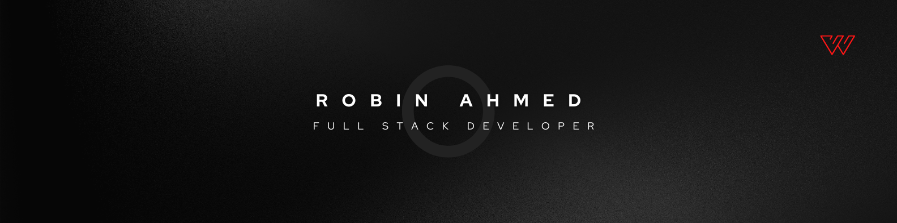

<div align="center">



</div>

<div align="center">

<br />


<div align="center">

```txt
Full Stack Developer | Angular | React.js | Next.js | Node.js | Express.jss
```

</div>

---

## About Me

```ts
const developer = {
  name: "Robin Ahmed",
  title: "Full Stack Developer",
  currentRole: "Junior Software Developer",
  frontend: ["HTML", "CSS", "JavaScript", "React.js", "Next.js", "Angular", "Tailwind CSS"],
  backend: ["Node.js", "Express.js", "REST API", "JWT Authentication", ".NET Core Web API"],
  database: ["PostgreSQL", "SQL Server", "MongoDB"],
  orm: ["Prisma", "EF Core"],
  tools: ["Git", "GitHub", "Figma", "VS Code", "Chrome DevTools"],
  focus: "Building clean, scalable, and user-friendly web applications",
};
```

I am a **Full Stack Developer** currently working in a corporate environment with **Angular**, while also building full-stack applications using the **MERN Stack**.

I enjoy creating responsive user interfaces, developing backend APIs, working with databases, and improving my code quality every day.

---

## Developer Toolbox

<table>
  <tr>
    <td width="180"><strong>Frontend</strong></td>
    <td>
      HTML, CSS, JavaScript, React.js, Next.js, Angular, Tailwind CSS, Responsive Design
    </td>
  </tr>
  <tr>
    <td><strong>Backend</strong></td>
    <td>
      Node.js, Express.js, REST API, JWT Authentication,
    </td>
  </tr>
  <tr>
    <td><strong>Database</strong></td>
    <td>
      PostgreSQL, SQL Server, MongoDB
    </td>
  </tr>
  <tr>
    <td><strong>ORM</strong></td>
    <td>
      Prisma,
    </td>
  </tr>
  <tr>
    <td><strong>Tools</strong></td>
    <td>
      Git, GitHub, Figma, VS Code, Chrome DevTools
    </td>
  </tr>
</table>

---

## Tech Stack

<div align="center">

### Frontend


### Backend


### Database & ORM


### Tools


</div>

---

## Current Build Mode

```txt
01. Working with Angular in a corporate software environment
02. Building full-stack applications using the MERN Stack
03. Improving REST API and backend development skills
04. Practicing clean and maintainable code
05. Learning scalable project structure and modern development workflow
```

---

## Professional Strengths

```md
- Adjusting to changing project requirements
- Learning new frameworks and libraries quickly
- Writing clean and maintainable code
- Building responsive and user-friendly interfaces
- Working with both frontend and backend technologies
- Solving real-world development problems
```

---

## Developer Identity

<div align="center">

<table>
  <tr>
    <td width="50%">
      <h3 align="center">Frontend Mindset</h3>
      <p align="center">
        I build clean, responsive, and user-friendly interfaces using
        <strong>Angular, React.js, Next.js, and Tailwind CSS</strong>.
      </p>
    </td>
    <td width="50%">
      <h3 align="center">Backend Mindset</h3>
      <p align="center">
        I develop REST APIs, authentication systems, and backend services using
        <strong>Node.js, Express.js, JWT</strong>.
      </p>
    </td>
  </tr>
</table>

</div>

---

## My Development Workflow

<div align="center">

<table>
  <tr>
    <td align="center" width="160">
      
      <br />
      <strong>Plan</strong>
      <br />
      Understand requirements
    </td>
    <td align="center" width="160">
      
      <br />
      <strong>Build</strong>
      <br />
      Write clean code
    </td>
    <td align="center" width="160">
      
      <br />
      <strong>Test</strong>
      <br />
      Check functionality
    </td>
    <td align="center" width="160">
      
      <br />
      <strong>Improve</strong>
      <br />
      Refactor and optimize
    </td>
  </tr>
</table>

</div>

---

## Code Philosophy

<div align="center">

```txt
Readable code is better than clever code.
Simple structure is better than confusing architecture.
Consistent improvement is better than waiting for perfection.
```

</div>

---

## GitHub Contribution Summary

<div align="center">


<br />
<br />


<br />
<br />


</div>

---

## Connect With Me

<div align="center">

<table>
  <tr>
    <td align="center" width="120">
      <a href="https://www.linkedin.com/in/robinahmed12/">
        
        <br />
        <strong>LinkedIn</strong>
      </a>
    </td>
    <td align="center" width="120">
      <a href="https://github.com/robinahmed12">
        
        <br />
        <strong>GitHub</strong>
      </a>
    </td>
    <td align="center" width="120">
      <a href="https://www.facebook.com/robin.ahmed.dev">
        
        <br />
        <strong>Facebook</strong>
      </a>
    </td>
   <td align="center" width="120">
  <a href="https://wa.me/8801716900294">
    
    <br />
    <strong>WhatsApp</strong>
  </a>
</td>

<td align="center" width="120">
  <a href="https://drive.google.com/file/d/1kWlNDg0pAg1JE2KL1Kn650q5K6uru2I8/view">
    
    <br />
    <strong>Resume</strong>
  </a>
</td>
  </tr>
</table>

</div>

<br />

---

<div align="center">


<br />
<br />


<br />


</div>
